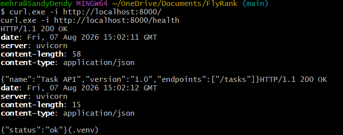
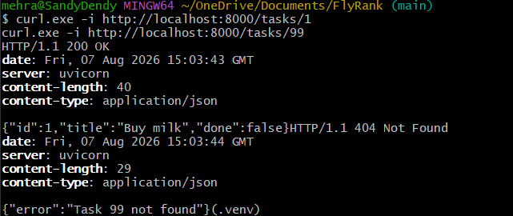
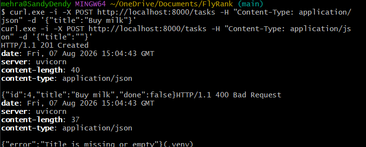
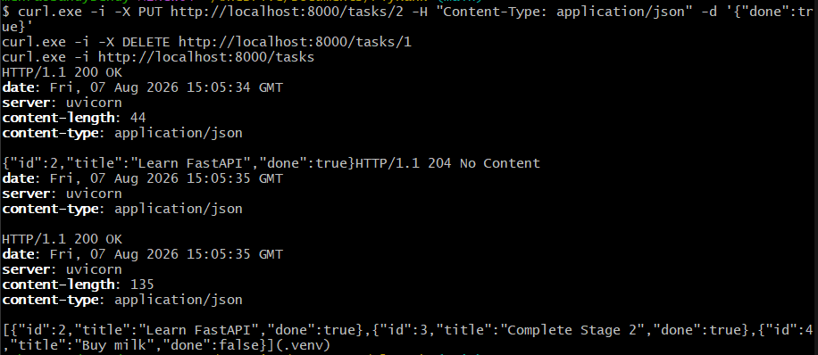

# Flyrank Task API

A CRUD API for managing a to-do list, built with Python and FastAPI for the flyrank.ai backend track.

## How to Install & Run

1. **Activate the virtual environment:**
   - Windows: `venv\Scripts\activate`
   - macOS/Linux: `source venv/bin/activate`
2. **Install dependencies:**
   `pip install -r requirements.txt`
3. **Start the server:**
   `uvicorn main:app --reload`

## Endpoints

| Operation | HTTP Method | Endpoint | Description |
| :--- | :--- | :--- | :--- |
| **API Info** | GET | `/` | Returns API name and version |
| **Health Check** | GET | `/health` | Checks if the server is alive |
| **Read All** | GET | `/tasks` | Returns a list of all tasks |
| **Read One** | GET | `/tasks/{id}` | Returns a single task by ID |
| **Create** | POST | `/tasks` | Creates a new task |
| **Update** | PUT | `/tasks/{id}` | Updates the title or completion status |
| **Delete** | DELETE | `/tasks/{id}` | Deletes a task by ID |

## Example Request & Response

Creating a new task via Command Prompt:

```text
> curl.exe -i -X POST http://localhost:8000/tasks -H "Content-Type: application/json" -d "{\"title\":\"Finish Stage 4\"}"

HTTP/1.1 201 Created
server: uvicorn
date: Fri, 31 Jul 2026 12:29:52 GMT
content-type: application/json
content-length: 48

{"id":4,"title":"Finish Stage 4","done":false}
```

## Screenshots

### Stage 1 (GET / & GET /health)


### Stage 2 (GET Task by ID)


### Stage 3 (POST Task)


### Stage 4 (PUT & DELETE)


### Stage 5 (Swagger UI)
📄 [See the Swagger UI PDF](./swagger-ui.pdf)